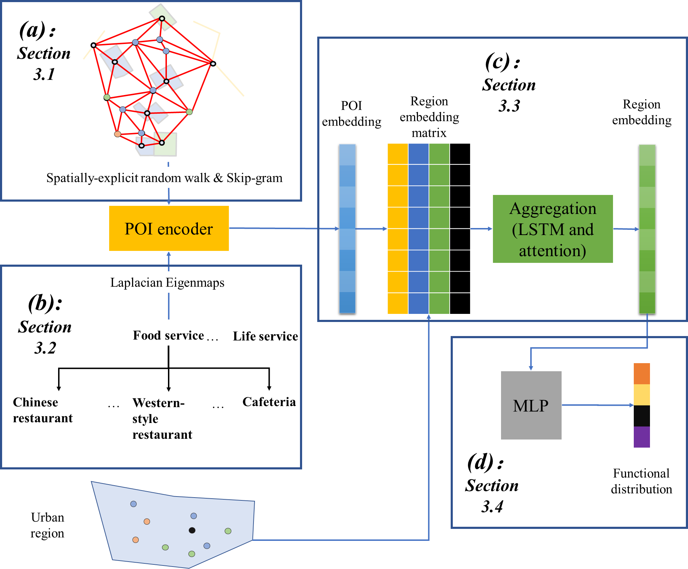

# Semantics preserved POI embedding

This project is linked to a submission to International Journal of Geographical Information Science, entitled “Estimating urban functional distributions with semantics preserved POI embedding”, which proposes a novel method for estimating functional distributions of urban regions (proportions of different function types in each region) with POIs.

The project includes both the data and codes that support this study.
## The architecture of the model:


## Content:
In the folder Data, there are:

1) Xiamen_region_partition.7z: a polygon shapefile that partitions the study area into a number of TAZs, which are used as the basic units for functional distribution estimation.


2) mock_ground_truth.tensor: the mocked ground truth data. The real ground truth data can be requested from http://geoscape.pku.edu.cn/en.html. Note that the ground truth data is the proportional distributions of urban functions, which is derived through overlapping a urban function classification map and the polygons in Xiamen_region_partition.7z:

The core of the program lies in the two python scripts:

1) poi_representation.py: this python script learns the POI (category) embeddings using the proposed approach. This script is linked to two other scripts:

  - poi_network.py that constructs POI DT networks from the data and performs spatially-explicit random walks on the network.

  - Variables.py that stores the hyperparameters used in the learning process; detailed annotations can be found in the script.

  - functional_distribution_learning.py: this script learns the functional distributions of the regions with the POI embeddings. Note that mocked ground truth data is used in this script.

The environment required for this project includes:

Python 3.8; Pytorch; Pytorch-geometric; Stellargraph; Pandas; sklearn; Scipy

## Citation

If you use the code in this project, please cite the paper in IJGIS
```
@article{huang2022estimating,
  title={Estimating urban functional distributions with semantics preserved POI embedding},
  author={Huang, Weiming and Cui, Lizhen and Chen, Meng and Zhang, Daokun and Yao, Yao},
  journal={International Journal of Geographical Information Science},
  year={2022},
  doi={10.1080/13658816.2022.2040510}
}
```

# Contact
Weiming Huang

Email: weiming.huang@nateko.lu.se
